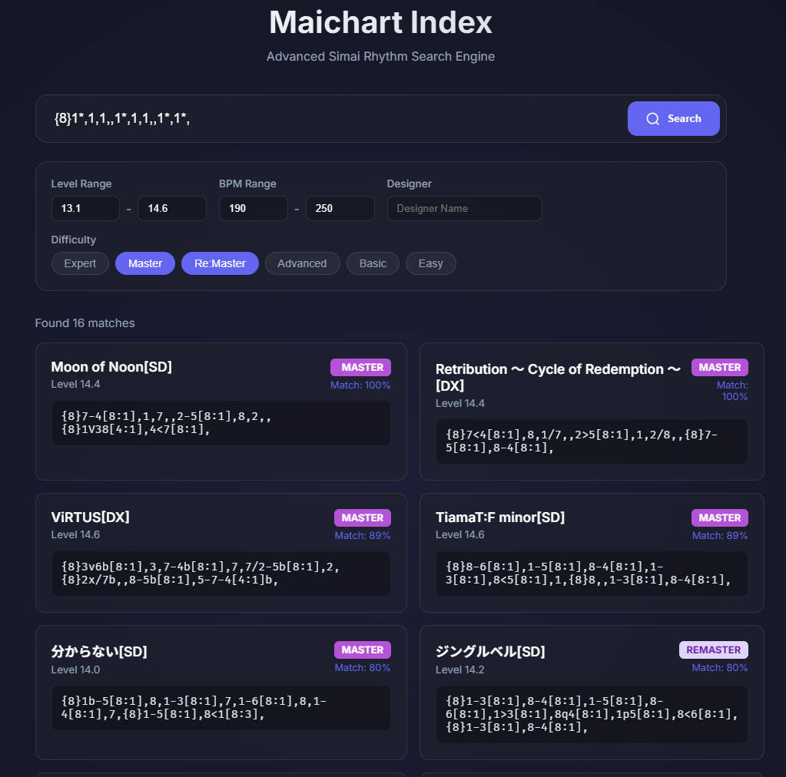

# Web 可视化搜索工具 (Web Tool)

MaichartIndex 提供了一个现代化的 Web 界面，让您可以通过图形化界面更直观地进行谱面搜索。

## 功能概览

*   **实时搜索**: 支持输入 Simai 节奏串进行搜索。
*   **交互式筛选**: 提供难度（Easy~ReMaster）、等级（Level Min/Max）、BPM 范围、谱师等多维度筛选控件。
*   **结果可视化**:
    *   **匹配度 (Match Degree)**: 显示查询节奏与谱面段落的匹配百分比（100% 为完美匹配）。
    *   **代码片段 (Snippet)**: 直接展示匹配到的 Simai 代码片段，并自动补全分辨率（如 `{16}`）。
    *   **信息卡片**: 清晰展示曲名、难度颜色标签、等级等信息。
*   **美观界面**: 采用 Glassmorphism 设计风格，支持响应式布局（适配移动端）。

*   **帮助卡片**: 搜索框下方设有可折叠的帮助区域，展示标准搜索示例（如 `{8}1,1,1,`）。
*   **页脚信息**: 包含 GitHub 仓库链接及作者信息。

## 启动方式

### 方法 1: 使用 CLI 命令
在项目根目录下，运行以下命令启动服务器：
```powershell
python main.py serve
```
默认将在随机空闲端口（50000-60000）启动服务，终端会显示具体访问地址（如 `http://0.0.0.0:54321`）。

可选参数：
*   `--port <int>`: 指定端口（输入 `0` 为随机端口）。
*   `--host <str>`: 指定主机（默认 0.0.0.0）。

### 反向代理 (Nginx)
Web 界面已适配反向代理部署（支持子路径，如 `/maichart/`）：
```nginx
location /maichart/ {
    proxy_pass http://127.0.0.1:54321/; # 指向实际端口
    # ... 其他标准头配置
}
```

### 方法 2: 使用独立可执行文件
如果您下载了 Release 版本的 `maichart-index.exe`，可以通过命令行运行：
```powershell
./maichart-index.exe serve
```
效果与 Python 脚本一致。

## 界面展示



## 技术细节

*   **后端**: 基于 **FastAPI** 框架，提供高性能的异步 API 接口 (`/api/search`)。
*   **前端**: 原生 HTML/CSS/JS 实现，无需额外构建步骤。
*   **打包**: 通过 PyInstaller 打包时，`server.py` 会自动处理静态资源路径 (`sys._MEIPASS`)，确保单文件运行正常。
